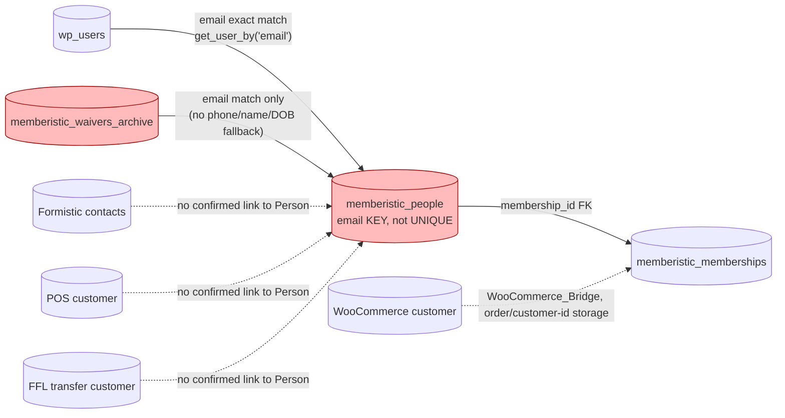
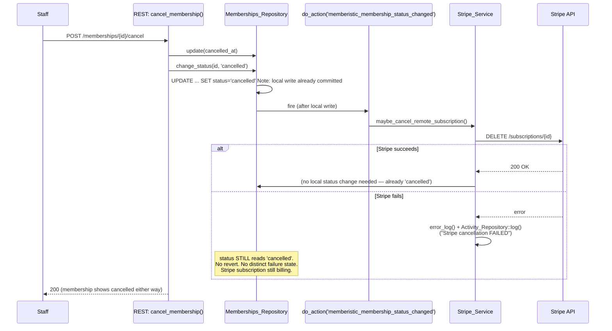
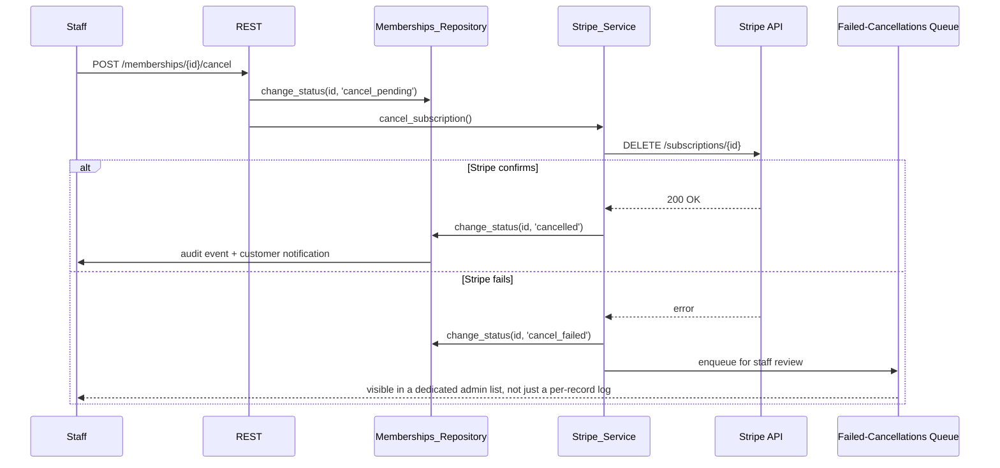
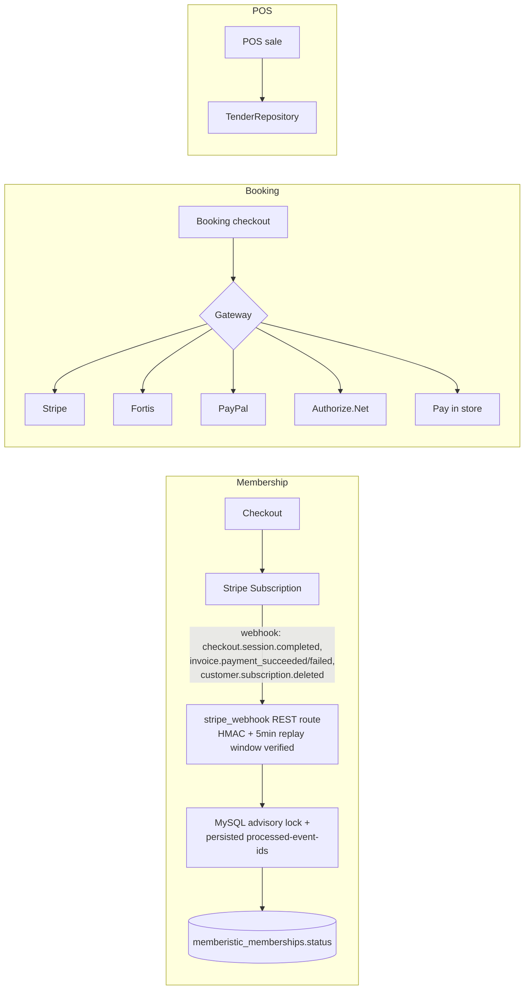
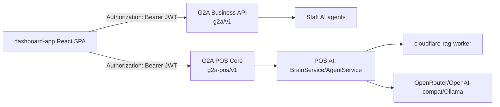
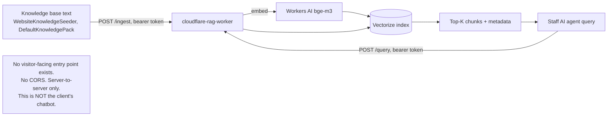

# Architecture and Data Flows

Diagrams reconstructed from source this session. Where a flow spans a hook/filter boundary, the exact hook name is called out — this is where cross-plugin integrations are most likely to silently break (mismatched hook name, wrong argument shape, plugin-presence guard missing).

## Full architecture (component level)

```mermaid
flowchart TB
    subgraph Edge["Edge / CDN"]
        CF[Cloudflare]
    end
    subgraph WP["WordPress (guns2ammo theme + plugins)"]
        Theme[guns2ammo theme<br/>g2a_biz single source of truth]
        Memberistic[Memberistic<br/>membership + billing + waivers]
        Booking[G2A Booking Engine<br/>lanes/classes/check-in]
        POS[G2A POS Core<br/>POS + wholesalers + FFL records]
        FFL[Advanced FFL Checkout<br/>transfer checkout]
        Formistic[Formistic<br/>contact forms + newsletter]
        Messageistic[Messageistic<br/>SMS + consent]
        BizAPI[G2A Business API<br/>dashboard backend]
        Verify[Verifyistic<br/>age gate]
        ThemeControl[G2A Theme Control]
        WaiverMgr[Guns2Ammo Waiver Manager]
        WC[(WooCommerce)]
    end
    subgraph External["External services"]
        Stripe[Stripe]
        Fortis[Fortis / PayPal / Authorize.Net]
        Lipseys[Lipsey's API/CSV]
        CFWorker[cloudflare-rag-worker<br/>Vectorize + Workers AI]
        AIProvider[OpenRouter/OpenAI-compat/Ollama]
        OtterText[Otter Text — externally injected,<br/>NOT in this repo]
    end
    subgraph Staff["Staff clients"]
        Dashboard[dashboard-app React SPA]
        WPAdmin[wp-admin]
    end

    CF --> Theme
    Theme -.g2a_biz&#40;&#41;.-> Memberistic
    Theme -.g2a_biz&#40;&#41;.-> Booking
    Theme -.g2a_biz&#40;&#41;.-> Formistic
    Booking <-->|memberistic_membership hooks| Memberistic
    Booking -->|g2ab_waiver_satisfied filter| Memberistic
    POS -->|waiver/booking sync| Booking
    POS --> WC
    POS <-->|CSV/API| Lipseys
    POS --> AIProvider
    POS --> CFWorker
    Memberistic --> Stripe
    Booking --> Fortis
    Memberistic -.WooCommerce_Bridge.-> WC
    FFL --> POS
    Dashboard --> BizAPI
    Dashboard --> POS
    WPAdmin --> Memberistic
    WPAdmin --> Booking
    WPAdmin --> POS
    OtterText -.external script, cleaned up defensively.-> Theme
```

## Customer identity (as-is — fragmented)

**Read this diagram as:** every solid arrow is a *confirmed* link found in source. Every dotted arrow is a link this audit could not confirm exists (either genuinely absent, or present in code not reached this pass — POS/Formistic customer-identity code was not deep-audited this session). The red-highlighted nodes are the two directly implicated in confirmed defects (`G2A-CRIT-004`, `G2A-HIGH-001`).

## Membership cancellation (as-is, showing the defect)

## Recommended cancellation flow (target state)

## Booking / class calendar (as-is, showing the provisioning gap)

```mermaid
flowchart TB
    Deploy[Deploy: zip overwrite to production] -->|does NOT fire| ActivationHook[register_activation_hook]
    ActivationHook -.only fires on first activate / reactivate.-> Activator[G2AB_Activator::activate&#40;&#41;]
    Activator --> Caps[register_roles_and_caps&#40;&#41;<br/>grants manage_g2ab_bookings etc. to administrator]
    Caps -.never re-runs on version bump alone.-> AdminMenu[Booking admin menu incl. Calendar]
    StaffLogin[Staff logs into wp-admin] --> CapCheck{Does user role have<br/>manage_g2ab_bookings?}
    CapCheck -->|No — never granted since<br/>last real activation| Invisible[Menu item does not render — no error, no message]
    CapCheck -->|Yes| Visible[Calendar, Bookings, Resources,<br/>Payments, Reports all visible]
```

## Waiver import → check-in (as-is, showing where the two paths diverge)

```mermaid
flowchart TB
    CSV[Otter Waiver CSV export] --> Import[Waiver_Import::import_file&#40;&#41;]
    Import --> Archive[(memberistic_waivers_archive<br/>idempotent by external_url,<br/>latest-signing-wins)]
    Import --> PDF[PDF mirrored to protected<br/>uploads/memberistic-waivers/<br/>.htaccess denied]
    Import -->|match_member: email only| WPUserLookup{WP user found<br/>by exact email?}
    WPUserLookup -->|Yes| StampAttempt[stamp_member&#40;&#41;]
    StampAttempt -->|Memberistic person<br/>record exists?| PersonCheck{get_by_email&#40;&#41;}
    PersonCheck -->|Yes| PersonUpdated[(memberistic_people.waiver_status = 'signed')]
    PersonCheck -->|No — silent no-op| Nothing[Nothing written.<br/>stats.members_matched already<br/>incremented by caller regardless.]

    Archive --> CheckinGate[Booking check-in: g2ab_waiver_satisfied filter]
    CheckinGate --> Bridge[Waiver_Booking_Bridge::satisfy&#40;&#41;<br/>re-derives from Archive.has_on_file&#40;&#41;<br/>by email+name — NOT from People_Repository]
    Bridge --> CheckinResult[Check-in gate: robust,<br/>independent of the stamping gap above]

    PersonUpdated -.-> AccountPage[Customer account page<br/>likely reads People_Repository.waiver_status]
    Nothing -.-> AccountPageStale[Account page can show<br/>stale/missing waiver status<br/>even though check-in works<br/>and the archive is correct]

    style Nothing fill:#fbb,stroke:#900
    style AccountPageStale fill:#fbb,stroke:#900
    style CheckinResult fill:#bfb,stroke:#090
```

## Lipsey's data flow (as-is, showing all three defects)

See `08-LIPSEYS-INTEGRATION-AUDIT.md` for the full end-to-end diagram with defect annotations — reproduced there rather than duplicated here to keep this file at the architecture level.

## Payment flows (high level)

## Dashboard / Business API

## AI / RAG

---

## Cross-plugin integration contract audit (spot-checked, not exhaustive)

| Producer hook/filter | Args | Consumer | Load-order / presence guard | Verdict |
|---|---|---|---|---|
| `memberistic_membership_status_changed` (action) | `(int $id, string $status)` | `Stripe_Service::maybe_cancel_remote_subscription()` | Registered via `add_action` inside the Stripe service class, which itself checks `self::is_enabled()` — degrades gracefully if Stripe isn't configured | Working, but see `G2A-CRIT-001` for the ordering defect around it |
| `g2ab_waiver_satisfied` (filter) | `(bool $ok, array $fields, mixed $booking_type)` | `Waiver_Booking_Bridge::satisfy()` (Memberistic) | `add_filter` unconditional on Memberistic load; booking-engine's `apply_filters()` call degrades to the form-submitted value if Memberistic isn't active | Working correctly — confirmed the more robust of the two waiver-status paths |
| `memberistic_stripe_webhook_event` / `memberistic_stripe_webhook_event_duplicate` (actions) | `(string $type, array $obj, array $event)` / `(string $event_id, string $type)` | Extension point — no in-repo consumer found this pass | Not dead code (fires unconditionally), but unused by anything in this repository currently | Config-dependent / extension point, not a defect |
| `memberistic_membership_expiring` / `memberistic_membership_expired` (actions) | `(int $membership_id, int $days_out)` / `(int $membership_id)` | Documented as feeding "the Messageistic SMS bridge" in source comments | Not independently traced into Messageistic this pass | **Live-verification-required** — recommend confirming Messageistic actually hooks these before relying on SMS renewal reminders in production |

Full hook inventory (every `add_action`/`do_action`/`add_filter`/`apply_filters` across ~1,000 PHP files) was not exhaustively cross-matched this session — the table above covers the hooks directly relevant to the client's priority items. A complete hook-contract audit (producer/consumer/arg-shape/load-order for every cross-plugin hook) is recommended as a dedicated Phase 2 task given the size of the surface (see `15-IMPLEMENTATION-BACKLOG.md`).
