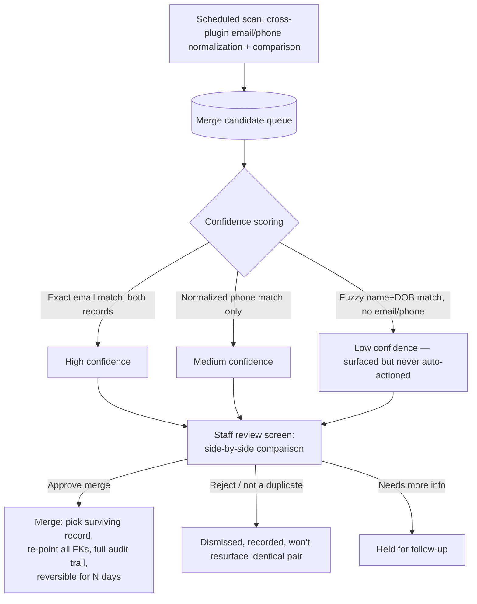

# Data Integrity and Reconciliation

## Customer identity — current state

There is no canonical cross-plugin person id. Every link between stores is either a direct foreign key (within one plugin) or a best-effort string match on email (across plugins). See `02-ARCHITECTURE-AND-DATA-FLOWS.md` for the identity diagram.

| Store | Key | Confirmed links out | Uniqueness enforced? |
|---|---|---|---|
| `wp_users` | `ID`, `user_email` | `memberistic_people.wp_user_id` (nullable FK, no confirmed enforcement it stays in sync) | WordPress core enforces unique `user_email` |
| `memberistic_people` | `id` | `membership_id` → `memberistic_memberships` (enforced FK-by-convention, indexed, not a real FK constraint — MySQL `KEY`, not `FOREIGN KEY`) | **No** — `email` is a plain `KEY`, not `UNIQUE` (`G2A-CRIT-004`) |
| `memberistic_waivers_archive` | `id`, `dedupe_key` (derived from email+first+last+dob) | Matched to `memberistic_people` by email only, at import time, one-shot (not re-checked later) | Dedupe key prevents duplicate *archive* rows for the same person; does not prevent the archive from being matched to the wrong (duplicate) `memberistic_people` row |
| Formistic contacts | presumed `id` + email | Not confirmed linked to `memberistic_people` this pass | Formistic's own dedupe (per client item 10's confirmation and prior docs) stops double-click submissions only, not cross-system duplicates |
| WooCommerce customers | `wp_users.ID` (WC customers are WP users) | `WooCommerce_Bridge` stores order/customer-id on the membership row | Inherits WP core's unique email |
| POS customers | Not traced this pass | Unknown | Unknown |
| FFL transfer customers | Not traced this pass (`g2a_ffl_transfers` table exists per `01-SYSTEM-INVENTORY.md`) | Unknown | Unknown |
| Messageistic contacts | Has a `Contact_Repository` (per `01-SYSTEM-INVENTORY.md` file list) | Not traced this pass | Unknown |
| Stripe customers | `stripe_customer_id` presumably on the membership row | One Stripe customer could plausibly be linked to multiple `memberistic_people`/membership rows given the same email-matching pattern seen elsewhere — **not independently confirmed**, flagged as a hypothesis consistent with the `G2A-CRIT-004` root cause, not a separately-verified finding | Unknown |

**Honest scope statement:** this pass verified the Memberistic-side identity model in depth (it's where the client's specific complaint lives) and the theme/booking-engine's read of it. POS, FFL, Formistic, and Messageistic's own internal customer-identity models were not independently traced to the same depth — the table above marks those cells "not traced this pass" rather than asserting a finding that wasn't verified. Recommend these be the first target of a follow-up pass before building the reconciliation tool below, since its value depends on knowing all the real join keys.

## Concrete duplicate-creation paths (confirmed or highly plausible from the confirmed schema gap)

1. **Confirmed:** `People_Repository::create()` never checks for an existing person by email (`class-people-repository.php:40-61`). Any caller — manual staff "add family member," a corporate group invite acceptance, a guest-to-member conversion — can create a second person row for an email already attached elsewhere.
2. **Confirmed:** `get_by_email()`'s `ORDER BY id DESC LIMIT 1` (`:96-106`) means any code that looks up "the" person by email (waiver stamping, and potentially others not audited this pass) silently resolves to the newest duplicate, which may not be the membership the operation actually intended.
3. **Plausible, not independently confirmed:** corporate group invite flows (`includes/corporate/class-corporate-module.php`, 2,600+ lines, not read in full this pass) are a likely second source of duplicate-creation given they involve email-based invites to potentially-existing people — flagged for follow-up, not asserted as confirmed.

## Recommended reconciliation tool design

**Non-negotiable design constraint (per audit brief and this repo's own demonstrated engineering culture, e.g. the `.htaccess`-plus-capability-check pattern on waiver PDFs): detect and flag only. No destructive auto-merge without deterministic evidence AND staff approval.**

**Detection rules (deterministic, explainable to a non-technical reviewer):**
- Two `memberistic_people` rows, exact-match normalized email (lowercase, trimmed), different `membership_id` → flag as "same email, different membership" (this is the exact class of bug `G2A-CRIT-004` allows to occur silently).
- Two `memberistic_people` rows, exact-match normalized phone (digits-only, country-code-normalized), different email or one/both empty → flag as "phone match, email mismatch."
- A `memberistic_people` row with a `wp_user_id` that does not match the `wp_users` row's own email → flag as "person record disagrees with its linked WP account."
- A `wp_users` row with no corresponding `memberistic_people` row at all where a WooCommerce order or booking exists for that email → flag as "customer with purchase history, no member record" (relevant to future segmentation work in `13-SEO-CRO-REVENUE-GROWTH.md`).

**Merge mechanics:**
- Never delete — the surviving record absorbs the FKs (`membership_id` re-pointing must be a deliberate staff choice when the two duplicates belong to *different* memberships, since that's not a pure dedupe, it's a decision about which membership the person actually belongs to).
- Every merge writes an `Activity_Repository` entry on both the surviving and (soft-deleted, not hard-deleted) losing record, with the staff user id, timestamp, and a snapshot of what changed — this repo already has the `Activity_Repository` pattern used consistently elsewhere (`class-memberships-repository.php` cancel/renew paths), so the merge tool should be the same pattern extended to people-level events, not a new logging mechanism.
- Reversible window (soft-delete/tombstone the losing record rather than hard-delete) — consistent with the counter checklist's own explicit rule: "Never delete a customer or contact record — flag it for review instead."

## Membership-linking integrity audit rules (client item 19)

Beyond the duplicate-email detection above, a dedicated pass should check:
- Every `memberistic_people` row's `waiver_status`/`waiver_signed_at` is internally consistent with a corresponding `memberistic_waivers_archive` "current" row for the same email (catches the `G2A-HIGH-001` class of drift going forward, not just at import time).
- Every membership's primary member (`role = 'primary'`) count per `membership_id` is exactly one (schema allows multiple; `get_primary_by_membership()`'s `ORDER BY id ASC LIMIT 1` silently picks the oldest if more than one exists — worth a one-time audit query: `SELECT membership_id, COUNT(*) FROM memberistic_people WHERE role='primary' GROUP BY membership_id HAVING COUNT(*) > 1`).
- Seat-count vs. `count_active_by_membership()` vs. the plan's configured seat limit, for corporate/family memberships — not independently traced into `class-corporate-module.php` this pass; recommend as a follow-up given that file's size (2,600+ lines) and the client's explicit report of "wrong people attached."

## Staff review screen (concept)

A new wp-admin screen (or a dashboard-app page, if that becomes the primary staff interface per `03-CLIENT-REQUIREMENTS-GAP-MATRIX.md`'s framing) listing the merge-candidate queue with:
- Side-by-side record comparison (name, email, phone, membership, waiver status, created date)
- One-click Approve / Reject / Hold
- A visible audit history of past merge decisions (for training new staff on what "normal" looks like, and for catching a staff member who mis-clicks)
- A **detach/reassign** action separate from merge — for the specific "wrong person attached to a membership" case where the two records are NOT duplicates of the same human, just incorrectly linked (e.g., a family member who left, or a staff data-entry error), the fix is detach-and-reassign, not merge. These are different operations and should be different buttons, not folded into one "fix it" action, to avoid a staff member accidentally merging two different real people because the UI only offered one resolution path.

## Payment/subscription reconciliation (cross-reference)

See `07-PAYMENTS-AND-MERCHANT-SERVICE-PLAN.md` for the Stripe-specific reconciliation design — noted here only to confirm the pattern is the same: detect drift, surface it, never auto-resolve a financial state without either explicit staff action or an unambiguous source-of-truth confirmation (e.g., Stripe's own webhook confirming a state, which the existing `reconcile_recurring_with_stripe()` pattern already does correctly for the expiry case — extend that same pattern to cancellation).
