# Payments and Merchant Service Plan

## Current payment architecture

| Flow | Gateway(s) | Coupling |
|---|---|---|
| Membership recurring billing | Stripe only | Direct — `class-stripe-service.php` calls the Stripe API directly throughout; no interface boundary |
| Booking / range / class payments | Stripe, Fortis, PayPal, Authorize.Net, pay-in-store | Already multi-gateway — `g2a-booking-engine/includes/payments/class-fortis.php`, `class-paypal.php`, `class-authnet.php` exist alongside Stripe |
| POS sales | `TenderRepository` (tender types not enumerated this pass) | Not deeply audited this pass |
| WooCommerce retail | WooCommerce's own gateway ecosystem, bridged to Memberistic via `WooCommerce_Bridge` for membership-product purchases | Indirect |

**The client's Stripe frustration is scoped correctly by this audit to Memberistic specifically** — Booking Engine already proves the team can and does build multi-gateway support. The gap is that Memberistic's billing was never built behind the same kind of abstraction.

## Stripe dependency map (Memberistic)

Every one of these calls Stripe's REST API directly via `Stripe_Service::request()`:
- `create_billing_portal_session()` — Customer Portal session creation
- `cancel_subscription()` — immediate or `cancel_at_period_end`
- `get_subscription()` — used by the expiry-reconciliation job
- `maybe_cancel_remote_subscription()` — the hook-driven cancel-propagation listener (`G2A-CRIT-001`)
- `process_webhook_event()` — consumes `checkout.session.completed`, `customer.subscription.deleted`, `invoice.payment_failed`, `invoice.payment_succeeded`, `payment_intent.*`
- Checkout session creation (`handle_checkout_request()`) — includes a genuinely well-built atomic rate limiter (MySQL advisory lock, 8 attempts/10 min per IP) to prevent scripted signup abuse

**Strengths worth preserving in any migration** (do not regress these when abstracting):
- HMAC signature verification with a 5-minute replay window (`verify_webhook_signature()`)
- Webhook idempotency via persisted processed-event-ids + MySQL advisory lock, specifically engineered to survive an object-cache flush (`process_webhook_event()`'s own code comments explain this was a deliberate fix for a documented Stripe double-delivery behavior)
- The expiry-reconciliation job (`class-scheduler.php:263` `reconcile_recurring_with_stripe()`) — asks Stripe for ground truth before hard-expiring a membership on a stale local `renewal_date`, specifically to tolerate a missed webhook

## Cancellation defect analysis

See `G2A-CRIT-001` in `04-CONFIRMED-DEFECTS.md` for full evidence. Summary: local status write happens before the remote Stripe call, and Stripe failure produces no compensating action beyond an Activity Repository log entry. The existing reconciliation-job *pattern* (used correctly for expiry drift) has simply not yet been extended to catch cancel-failure drift — this is encouraging: the team already understands and has implemented the correct pattern once, they need to apply it to a second state transition.

## Reconciliation design (extending the existing pattern)

```mermaid
flowchart TB
    Cron[Scheduled job, e.g. hourly] --> Query[Query memberships where<br/>status='cancel_failed' OR<br/>&#40;status='cancelled' AND stripe_subscription_id<br/>still shows active per last known check&#41;]
    Query --> Recheck[Ask Stripe: what is this<br/>subscription's real status?]
    Recheck -->|Stripe confirms canceled| Resolve[Clear cancel_failed,<br/>confirm local='cancelled', log resolution]
    Recheck -->|Stripe still active| Retry[Retry cancel_subscription&#40;&#41;]
    Retry -->|Success| Resolve
    Retry -->|Fail again, N attempts exceeded| Escalate[Escalate: surface in the<br/>failed-operations queue as<br/>requires_manual_review,<br/>notify a manager, not just log]
```



This is a small addition to `class-scheduler.php`, not a new subsystem — it belongs right next to `run_auto_expire()`/`reconcile_recurring_with_stripe()` as a sibling scheduled method, reusing the same Stripe-truth-first philosophy.

## Gateway abstraction design

```text
interface MembershipGatewayInterface {
    public function createCustomer(array $customerData): GatewayCustomer;
    public function createSubscription(GatewayCustomer $customer, Plan $plan): GatewaySubscription;
    public function retrieveSubscription(string $subscriptionId): ?GatewaySubscription;
    public function cancelSubscription(string $subscriptionId, bool $atPeriodEnd = false): CancelResult;
    public function pauseSubscription(string $subscriptionId): PauseResult;
    public function resumeSubscription(string $subscriptionId): ResumeResult;
    public function updatePaymentMethod(GatewayCustomer $customer, array $methodData): UpdateResult;
    public function refundPayment(string $paymentId, ?float $amount = null): RefundResult;
    public function processWebhook(string $payload, string $signatureHeader): WebhookEvent;
    public function reconcileSubscription(string $subscriptionId): ReconcileResult;
    public function createCustomerPortalSession(GatewayCustomer $customer, string $returnUrl): PortalSession;
}
```

**How far current code is from this:** `Stripe_Service` already implements the *behavior* of nearly every one of these methods (`cancel_subscription`, `get_subscription` ≈ `retrieveSubscription`, `create_billing_portal_session` ≈ `createCustomerPortalSession`, `process_webhook_event` ≈ `processWebhook`, the scheduler's Stripe-truth-check ≈ `reconcileSubscription`). What's missing is purely structural: none of these are behind an interface, they're static-method calls to a concrete class referenced by name throughout `class-memberships-controller.php` and `class-scheduler.php`. **This is a mechanical refactor, not new engineering** — extract `Stripe_Service`'s existing methods behind `MembershipGatewayInterface`, rename the concrete class to `StripeGateway implements MembershipGatewayInterface`, and update the ~5-10 call sites (controller, scheduler, admin menu) to resolve the active gateway from a setting rather than hardcoding the class name. `pauseSubscription`/`resumeSubscription` and a generic `refundPayment` are the only genuinely new surface area not already present in some form.

## Gateway options evaluated

| Provider | Current support | Migration readiness |
|---|---|---|
| Stripe | Full (Memberistic), full (Booking Engine) | N/A — incumbent |
| Fortis | Full support in Booking Engine already; **zero** presence in Memberistic | Best-positioned candidate given the client's own prior scoping and existing Booking Engine precedent — building the `FortisGateway` adapter reuses patterns already proven in `class-fortis.php` |
| Authorize.Net | Full support in Booking Engine; zero in Memberistic | Viable second option |
| NMI | Not found in either plugin | Would be new integration work |
| WooCommerce gateways | WooCommerce itself supports many; `WooCommerce_Bridge` exists for membership-product purchases but this is a different mechanism than a `MembershipGatewayInterface` adapter | Architecturally distinct path, not directly comparable |
| Pay-in-store | Supported in Booking Engine (`g2ab_payment_gateway_default => 'pay_in_store'` default option) | Already proven for one-time payments; recurring membership billing via pay-in-store would need a manual-renewal staff workflow, not a gateway adapter |
| ACH / card-present | Not found in either plugin | New integration work regardless of provider chosen |

## Safe Stripe replacement strategy

1. Build `MembershipGatewayInterface` + `StripeGateway` (the refactor above) — zero behavior change, pure structural safety net. Ship and verify nothing regressed.
2. Build the second gateway adapter (client's processor decision required — Fortis is the best-positioned candidate given existing Booking Engine precedent).
3. Route **new signups only** through the new gateway behind a setting. Existing Stripe subscriptions continue untouched, unaffected by the new gateway's code entirely.
4. Prove full lifecycle on the new gateway with real (or sandbox, if the provider offers one) transactions: create → renew → cancel → refund → webhook-driven state sync, matching the same guarantees Stripe currently has (idempotency, signature verification).
5. Only once step 4 is proven, offer existing Stripe subscribers a migration path (re-authorization, not a silent card-on-file transfer, for PCI/consent reasons) — this is a customer-facing, opt-in action, not a backend data migration.
6. Retire Stripe by attrition: stop when its active-subscription count hits zero, not on a calendar date.

## Migration risks

- **Double-billing risk during the cutover window** if a subscription is accidentally represented in both gateways simultaneously — the interface's `reconcileSubscription()` should be run as a pre-condition before any subscription is considered "migrated," and the local schema needs a `payment_gateway` column (may already exist — `row_has_recurring_billing()` in `class-scheduler.php` checks `payment_source` which suggests this concept exists; confirm it's gateway-name-capable, not Stripe-boolean, before building the abstraction).
- **Webhook signature verification must be gateway-specific and never shared** — a naive abstraction that reuses one signature-verification code path for multiple gateways is a security risk; each `processWebhook()` implementation must independently verify against its own gateway's secret.
- **The idempotency and reconciliation patterns already proven for Stripe must be re-proven for the new gateway before it carries real subscriptions** — do not assume a different processor's webhook delivery guarantees match Stripe's (retry behavior, delivery ordering, replay windows all vary by provider).
- **Do not shut down Stripe webhook processing while any Stripe subscription is still active** — even after the new gateway launches, Stripe events must keep flowing for existing subscribers until the last one is migrated or naturally lapses.
