# Lipsey's Integration Audit

**Location:** `g2a-pos-core/includes/Wholesalers/Lipseys/` (provider-specific: `LipseysProvider.php`, `LipseysApiClient.php`, `LipseysCsvImporter.php`, `LipseysCatalogMapper.php`, `LipseysPayloadBuilder.php`, `LipseysDropShipPolicy.php`), `includes/Wholesalers/Media/LipseysImageUrls.php`, generic wholesaler infrastructure in `includes/Database/WholesalerRepository.php`, `includes/Wholesalers/WholesalerImportBridge.php`, `includes/Wholesalers/Promotion/VendorProductPromoter.php`. Test coverage exists: `tests/Unit/Lipseys*Test.php` (5 files).

## End-to-end data flow

```mermaid
flowchart TB
    subgraph Auth["Account selection"]
        Config[Two wholesaler rows configured:<br/>firearms account, accessories account,<br/>both provider_code='lipseys']
        FindByCode["WholesalerRepository::findByCode('lipseys')<br/>ORDER BY id ASC LIMIT 1"]
        Config --> FindByCode
        FindByCode -->|Always returns the SAME row| OneAccount[Only the first-created account<br/>is ever reachable]
    end

    subgraph Fetch["Catalog / inventory fetch"]
        CSV[CSV export] --> Importer[LipseysCsvImporter]
        API["API CatalogFeed<br/>(GET /api/Integration/Items/CatalogFeed)"] --> Importer
        OneAccount --> Importer
    end

    subgraph Normalize["Normalization"]
        Importer --> Mapper[LipseysCatalogMapper::mapRow / mapApiItem<br/>SKU, UPC, price, MAP, stock, FFL flag,<br/>item_type classification, ~50 attribute columns]
        Mapper --> Staging[(g2a_wholesaler_products staging table)]
    end

    subgraph CategoryGap["Category mapping — BUILT BUT NOT WIRED"]
        Staging --> VendorCat[vendor_category field]
        WCCatMap[(g2a_wholesaler_categories<br/>wc_category_id column, savable via repo)]
        VendorCat -.only used for markup_percent pricing lookup.-> Promoter
        WCCatMap -.NEVER READ by promotion code.-> Promoter
    end

    subgraph Images["Image handling"]
        Staging --> ImgName[image_filename from IMAGENAME column]
        ImgName --> CdnUrl["LipseysImageUrls::cdnUrl&#40;&#41;<br/>https://www.lipseyscloud.com/images/&lt;file&gt;"]
        CdnUrl --> Hotlink[Hotlinked directly —<br/>NEVER mirrored to local media library]
    end

    subgraph Promotion["WooCommerce promotion"]
        Promoter[VendorProductPromoter]
        Staging --> Promoter
        Promoter --> WCProduct[(WooCommerce product created/updated:<br/>SKU, price, _stock, _stock_status)]
        Promoter -.-> NoCategory[No product_cat term ever assigned]
        Hotlink -.-> WCProduct
    end

    style FindByCode fill:#fbb,stroke:#900
    style OneAccount fill:#fbb,stroke:#900
    style WCCatMap fill:#fbb,stroke:#900
    style NoCategory fill:#fbb,stroke:#900
    style Hotlink fill:#ffd,stroke:#960
```



## Account handling — CONFIRMED DEFECT (re-verified, see G2A-CRIT-002)

**Claim under test:** "provider-code-only lookup can select the wrong Lipsey's account; blank account numbers can let one account's credentials silently overwrite the other's."

**Verdict: CONFIRMED**, both halves, with exact code:

```php
// WholesalerRepository.php:22-33
public function findByCode( string $code ): ?array {
    ...
    $row = $wpdb->get_row(
        $wpdb->prepare(
            "SELECT * FROM {$t} WHERE provider_code=%s ORDER BY id ASC LIMIT 1",
            $code
        ), ARRAY_A
    );
    return $row ?: null;
}
```
`LipseysProvider::CODE = 'lipseys'` is a single literal (`LipseysProvider.php:13`), identical for both the client's firearms and accessories accounts. `WholesalerImportBridge::resolve_wholesaler_id()` (`:83-98`) is the only caller reachable from the live CSV/API import path, and it calls `findByCode($provider->code())` with no account-specific parameter. **Once one Lipsey's account row exists, every subsequent import — for either account — resolves to that same row.**

```php
// WholesalerRepository.php:51-60 (inside upsert())
$existing = $wpdb->get_var(
    $wpdb->prepare(
        "SELECT id FROM {$t} WHERE provider_code=%s AND (account_number=%s OR (%s='' AND (account_number IS NULL OR account_number='')))",
        $providerCode, $account, $account
    )
);
```
If a second account is saved with a blank `account_number`, this matches the FIRST account's row (also blank/matching) and **updates** it — silently overwriting stored credentials — instead of inserting a new row.

**This is the direct, mechanical explanation for "API attempted, same result" and "product categories didn't seem to carry over."** The accessories account (or whichever was configured second) has likely never actually been reachable through an import.

## Category mapping — CONFIRMED "built but not wired" (G2A-CRIT-003)

The data model is more complete than a first glance suggests — this is not "no category-mapping table exists," it's "the category-mapping table exists, is configurable, and is silently never applied":

- `Migrator.php:449` — `wc_category_id BIGINT UNSIGNED NULL` column on `g2a_wholesaler_categories`
- `WholesalerCategoryRepository.php:61` — `wc_category_id` is in the `$allowed` fields list for updates (i.e., a settings screen can save it)
- `VendorProductPromoter.php` — loads `$categories = $categoryRepo->all($wholesalerId)` (line 57) but the ONLY use of that data is a markup-percent lookup keyed on `vendor_category` (lines 158-160). Repo-wide search for `wp_set_object_terms`, `set_category_ids`, or any read of `wc_category_id` outside the repository/schema files themselves: **zero results.**

**Fix is small and isolated:** in the same block where `VendorProductPromoter` already looks up the matching category row for pricing, also read `wc_category_id` and call `wp_set_object_terms($productId, [(int) $cat['wc_category_id']], 'product_cat')` (or the equivalent `WC_Product::set_category_ids()`) before saving.

## Images — CONFIRMED hotlink-only, no mirroring

```php
// LipseysImageUrls.php — full logic
public static function cdnUrl( string $imageFilename ): ?string {
    ...
    return self::CDN_BASE . rawurlencode( $name ); // https://www.lipseyscloud.com/images/<file>
}
```
No download-to-media-library step exists anywhere in the promotion path checked this session. This directly answers the client's "images might be helpful but I am not understanding why that API [is] not transferring over" — there is no "transfer" at all; the storefront links directly to Lipsey's CDN. If that CDN blocks hotlinking by referrer, renames/removes a file, or the filename-to-URL construction doesn't match Lipsey's actual current CDN path scheme, every affected product photo breaks with **no local fallback**. This audit cannot confirm or rule out a hotlink-blocking issue without live network access to `lipseyscloud.com` from the production origin — flagged **Live-verification-required**, with the architectural fact (no mirroring) confirmed regardless of that live check's outcome.

## Inventory-zeroing risk — investigated, lower risk than the worst-case hypothesis

The audit brief specifically asks whether a failed API call can zero out storefront inventory. Investigated: `VendorProductPromoter`'s stock write (`_stock`, `_stock_status`) is driven per-row by `$vendor['stock_qty']` from whatever rows are present in the `g2a_wholesaler_products` staging table — it does not do a blanket "zero everything not seen this run" pass. `LipseysCsvImporter.php` contains no `DELETE`/`TRUNCATE` statement — it is upsert-only, keyed per-row (by SKU/UPC), so a partial or empty CSV/API response would upsert fewer or zero rows rather than wiping existing staged data for products missing from that response. **This lowers the risk relative to the worst-case "one bad sync zeroes the whole store" scenario**, but was not proven airtight — the full upsert-key logic and what happens on a genuinely malformed (not just empty) file was not traced to 100% certainty this pass. Recommend a deliberate test (import an intentionally truncated/malformed CSV against a staging catalog) as the concrete verification step before relying on this conclusion in production.

## Failure handling, retries, timeouts, cron

Not exhaustively audited this pass (budget was concentrated on the three confirmed defects above, which map directly to the client's specific complaints). `LipseysApiClient.php` exists as a dedicated API client class, suggesting a normal HTTP-client structure with presumable timeout handling — not verified line-by-line. Recommend as a follow-up: confirm timeout values are sane (not infinite, not so short that large catalogs partially fail), confirm retry limits exist and are bounded, confirm cron scheduling doesn't overlap a prior still-running sync.

## Duplicate products / SKU-UPC identity

`LipseysCatalogMapper::mapRow()` normalizes `vendor_sku` (from `ITEMNO`) and `upc` — the actual dedupe-on-promotion logic (matching an existing WooCommerce product by SKU/UPC vs. creating a new one) lives in `VendorProductPromoter.php`'s product-lookup step, which was read for the stock-write section above but not independently stress-tested for SKU/UPC collision edge cases (e.g., a product whose UPC changes between syncs, or two Lipsey's items sharing a manufacturer part number). Flagged for the test plan below.

## Complete test plan

1. **Two-account reachability (regression test for G2A-CRIT-002 fix):** configure firearms + accessories accounts with distinct account numbers; run an import for each; confirm both produce distinct `g2a_wholesalers` rows and distinct product sets in `g2a_wholesaler_products`.
2. **Category mapping (regression test for G2A-CRIT-003 fix):** configure a `wc_category_id` mapping for one vendor category; promote a product in that category; assert the resulting WooCommerce product has the correct `product_cat` term.
3. **Image mirroring (if G2A-HIGH-003 is fixed):** promote a product; confirm a local media attachment exists and is used as the featured image.
4. **Malformed/empty file safety:** import a deliberately truncated or empty CSV against a staging catalog with pre-existing promoted products; confirm no existing product's stock is zeroed as a side effect.
5. **SKU/UPC collision:** promote a product, then re-run promotion with the same SKU but a changed UPC (or vice versa); confirm the system updates the correct existing WooCommerce product rather than creating a duplicate.
6. **MAP pricing display:** confirm `map_price` from the mapper reaches the correct WooCommerce price-display behavior (the repo has a `display_mode` concept — `'click_to_reveal'` seen in `MapRuleRepository.php` — confirm this actually renders correctly on the product page).
7. **FFL-required flag:** confirm a promoted firearm correctly sets whatever flag `advanced-ffl-checkout` reads to require the FFL transfer flow at checkout (cross-plugin integration — not traced this pass).
8. **End-to-end account-specific sync via the fixed resolution logic**, run against both accounts back-to-back, confirming neither's credentials or catalog data leak into the other's promoted products.

## Verdict

**Is Lipsey's ready for automatic production sync? NO** — two of the three confirmed defects (account resolution, category mapping) directly and predictably reproduce the client's exact reported symptoms, and both have small, isolated, well-understood fixes. Do not enable an automated/scheduled sync until G2A-CRIT-002 and G2A-CRIT-003 are fixed and the test plan above passes against a staging catalog import — an automated sync running the current code on a schedule would silently keep re-confirming the same two symptoms indefinitely rather than surfacing them as fixable.
