# Waiver, Contact, and Membership Migration

**Location:** `memberistic-membership-solutions/includes/waivers/class-waiver-import.php` (the importer), `class-waivers.php` (viewing/export/print), `class-waiver-booking-bridge.php` (check-in integration), `class-waivers-archive.php` (the archive table). The standalone `guns2ammo-waiver-manager` plugin (3 files, 259 LOC) is a thin companion — the real logic lives in Memberistic.

## Otter Waiver import flow (verified end-to-end this session)

```mermaid
flowchart TB
    CSV[Otter Waiver CSV export] --> ReadCSV[read_csv&#40;&#41;<br/>BOM-stripped, header-mapped]
    ReadCSV --> Normalize[normalize_row&#40;&#41;<br/>email lowercased, dates parsed<br/>MM/DD/YYYY and ISO 8601 handled]
    Normalize --> Dedupe[Group by dedupe_key<br/>&#40;email+first+last+dob&#41;,<br/>latest signed_at wins]
    Dedupe --> Idempotent{already_imported&#40;external_url&#41;?}
    Idempotent -->|Yes, and not --fresh| Skip[Skipped — safe to re-run]
    Idempotent -->|No| PDF[mirror_pdf&#40;&#41; for the current<br/>&#40;latest&#41; entry only]
    PDF --> ProtectedDir["uploads/memberistic-waivers/<br/>.htaccess: Require all denied<br/>+ silent index.php"]
    Dedupe --> MatchEmail{match_member&#40;&#41;:<br/>get_user_by&#40;'email'&#41;<br/>EXACT match only}
    MatchEmail -->|WP user found| StampAttempt[stamp_member&#40;&#41;]
    StampAttempt --> PersonLookup{People_Repository::<br/>get_by_email&#40;&#41;}
    PersonLookup -->|Found| WriteStatus[(waiver_status = 'signed'<br/>waiver_signed_at set)]
    PersonLookup -->|Not found| SilentNoop[Silent no-op —<br/>BUT caller already counted<br/>this as members_matched++]
    MatchEmail -->|No WP user| NoMatch[Counted as unmatched<br/>only in the SEPARATE<br/>dry-run report&#40;&#41; mode]

    style SilentNoop fill:#fbb,stroke:#900
    style NoMatch fill:#ffd,stroke:#960
```



## Matching rules — verified precisely

- **Email:** exact match via `get_user_by('email', $entry['email'])` (WordPress core, case-sensitive on the stored value, though the CSV-side value is lowercased before comparison — a WP user whose stored email has different casing could still match since MySQL's default collation is typically case-insensitive, but this was not independently confirmed).
- **Phone:** captured in the normalized row (`sanitize_text_field` on the `Phone` CSV column) and stored on the archive record, but **never used as a fallback match key**. If email is blank or doesn't match a WP user, phone is not consulted.
- **Name + DOB:** used only to build the `dedupe_key` (collapsing repeat signings by the same person within the CSV itself into one current record) — **not** used to match against existing Memberistic people/WordPress users. So a walk-in who signed with a slightly different email address (typo, or a second personal email) than the one on file will not be matched even though name+DOB might make the match obvious to a human.
- **Latest-waiver-wins:** confirmed — `usort()` by `signed_at` descending, only entry index `0` gets `is_current = 1` and gets its PDF mirrored; older revisions keep only their source URL, not a local mirror.
- **Minor waivers / emergency contacts:** captured as fields (`minor_name`, `minor_age`, `emergency_name`, `emergency_phone`) on the archive row — stored, but this pass did not verify whether a minor's waiver is matched to a *guardian's* Memberistic person record (the logical correct behavior) or attempted to match under the minor's own identity (which would almost always fail, minors rarely having their own WP account/email). **Flagged as a follow-up verification item, not resolved this pass.**

## PDF mirroring and protected storage — verified strong

- Downloaded via `download_url()` (WordPress core), copied into `wp-content/uploads/memberistic-waivers/`, source temp file cleaned up.
- Directory hardened on creation: `.htaccess` with `Require all denied` (Apache 2.4+) and a legacy `Order allow,deny / Deny from all` fallback for older Apache, plus a silent `index.php`.
- The only in-app route that serves these files (`class-waivers.php`'s export/print/poster handlers) additionally requires `memberistic_current_user_can(self::CAP)` before serving — **defense in depth confirmed**: direct URL guessing is blocked at the web-server level, and the authenticated app-level route is also capability-gated (minor gap: nonce is generated but never actually verified server-side — see `G2A-MED-001`, low severity given the capability gate is still enforced).

## Import idempotency — verified

Re-running the same CSV is safe: `already_imported()` checks for an existing archive row by `external_url` and skips it unless `--fresh` is explicitly passed (which `TRUNCATE`s the archive table first — a deliberate, clearly-named destructive option, not a default). This satisfies the audit brief's idempotency requirement.

## Import reporting — confirmed gap

Two different code paths exist and report different things:
- `report()` (dry-run mode, `--dry-run` flag): computes an aggregate `unmatched` **count** — no list of which people, just a number.
- `import_file()` (real run): reports `members_matched` — which, per `G2A-HIGH-001`, can be **wrong** (overcounts relative to actual `waiver_status='signed'` writes) because it doesn't distinguish "WP user matched" from "Memberistic person record actually stamped."

**Neither path produces an itemized, actionable unmatched/unstamped report** — exactly what the client explicitly asked for ("the unmatched-waiver report so nothing falls through unnoticed," per the client's prior status doc, echoed in this audit's own brief). This is the single most important fix before the next/final Otter Waiver import run.

## Booking/check-in integration — verified robust, and independent of the stamping gap

This is the most reassuring finding in this section: the actual range check-in gate does **not** depend on `People_Repository.waiver_status` (the field `stamp_member()` can fail to write). It re-derives directly from the archive:

```php
// class-waiver-booking-bridge.php
public static function satisfy( $ok, $fields, $booking_type ) {
    if ( $ok ) { return true; }
    ...
    return Waivers_Archive::has_on_file( $email, $name ) ? true : (bool) $ok;
}
```
This answers the booking engine's `g2ab_waiver_satisfied` filter by looking directly at the archive (by email + name), not the possibly-stale person record. **Practical consequence: a customer whose waiver was correctly imported into the archive but whose person-record stamp silently failed will still pass the check-in gate correctly** — the defect's real-world impact is confined to what the **customer's own account page displays**, not actual range access. This distinction matters for how urgently this needs to be fixed and how it should be communicated to the client (it's a display/trust issue, not a safety gate issue).

## Customer-account status display — likely affected, not independently confirmed

`memberistic-membership-solutions/templates/account.php` was found (in initial recon) to reference `waiver_status`, which is consistent with it reading `People_Repository`'s field rather than the archive directly — meaning it is plausibly subject to the same staleness the check-in gate is immune to. **This specific template was not read in full this session** to confirm the exact field it displays; flagged as the one remaining concrete check needed to close out this finding with full certainty.

## Required result — verified against actual behavior

> Imported Otter waiver → matched to the correct person → shown as signed/current on the customer account → visible at check-in → protected PDF available to authorized staff

| Step | Status |
|---|---|
| Imported | ✅ Verified working, idempotent |
| Matched to the correct person | ⚠️ Email-only matching; can silently mismatch if `G2A-CRIT-004`'s duplicate-person condition exists for that email (most-recent-row-wins) |
| Shown as signed/current on the customer account | ❌ **Likely broken** for any row where `stamp_member()` silently no-ops (`G2A-HIGH-001`) — needs the `account.php` template read to fully confirm |
| Visible at check-in | ✅ **Verified working**, independently of the above, via `Waivers_Archive::has_on_file()` |
| Protected PDF available to authorized staff | ✅ Verified — `.htaccess` + capability-gated app route |

## Migration acceptance checklist (before Otter Waiver is cancelled)

- [ ] Fix `stamp_member()` to report success/failure distinctly, add a real unmatched/unstamped itemized report (not just a count)
- [ ] Read `templates/account.php` to confirm exactly what it displays and fix if it reads the stale field
- [ ] Re-run the import against the **current, full** Otter Waiver export (not the historically-validated 1,922-row run referenced in prior docs — that was validated once, not necessarily against the final/complete data set)
- [ ] Review the itemized unmatched report with the client/staff; resolve or explicitly accept each unmatched record
- [ ] Confirm minor-waiver-to-guardian matching behaves as intended (follow-up item above)
- [ ] Spot-check 10-20 real customer account pages against their known waiver status
- [ ] Confirm PDF count in `uploads/memberistic-waivers/` is consistent with the archive's row count (`pdfs` vs `pdf_failed` stats from the import run)
- [ ] Only after all of the above: schedule Otter Waiver cancellation with the vendor

## Rollback and preservation plan

- The archive table (`memberistic_waivers_archive`) and mirrored PDFs are the durable local copy — once populated and verified, Otter Waiver's own data becomes redundant, not load-bearing.
- Before cancelling Otter Waiver, export a final full CSV backup (outside this system, e.g., to cold storage) as a disaster-recovery fallback independent of both Otter Waiver's continued existence and this system's own database.
- `--fresh` (which truncates the archive) should never be run against production without a fresh database backup immediately prior — this is a real, existing capability in the tool that a staff member could invoke by mistake; consider gating it behind an additional confirmation step or a higher capability requirement if it isn't already (not independently verified which capability guards CLI/admin access to the `--fresh` flag specifically).
