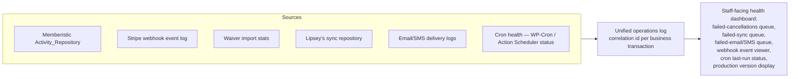

# Performance, Reliability, and Observability

## Verification commands actually executed this session

Per the audit brief's instruction: nothing below is claimed without having been actually run. Full logs are in the session's scratch directory; results summarized here.

| Command | Result | Notes |
|---|---|---|
| `find . -name "*.php" ... \| xargs php -l` | ✅ **PASS — 975/975 files, zero syntax errors** | Full repo, excluding vendor/node_modules |
| `cd dashboard-app && npm ci` | ✅ PASS — 177 packages installed | 2 vulnerabilities reported (1 moderate, 1 high) — not triaged this pass, see `11-SECURITY-PRIVACY-COMPLIANCE.md` |
| `npm run typecheck` (`tsc -b --noEmit`) | ✅ PASS | Zero type errors |
| `npm run lint` (`eslint .`) | ❌ **FAILED — environment/config issue, not a code defect.** ESLint 10.1.0 requires flat config (`eslint.config.js`), which does not exist in the project; error is "ESLint couldn't find an eslint.config.(js\|mjs\|cjs) file." Exit code 2. | Missing requirement: `eslint.config.js` (or downgrade ESLint to `^8`). This means lint has not been enforceable with the currently-pinned tooling for however long this drift has existed. |
| `npm run build` (`tsc -b && vite build`) | ✅ PASS | Produces `dist/assets/index-*.js` at 726.86 kB (203.94 kB gzip) as a single chunk; Vite's own warning flags this exceeds its 500 kB chunk-size guidance |
| `composer install` + `vendor/bin/phpunit` — g2a-business-api | ✅ **PASS — 497 tests, 1,221 assertions, 0 failures** | Two lines of stdout during the run ("failed to ingest Formistic submission #2: simulated write failure", "failed to ingest booking #9001: simulated malformed booking row") are deliberate fixture output from tests that exercise failure-handling paths — not real failures; final result line is `OK (497 tests, 1221 assertions)` |
| `composer install` + `vendor/bin/phpunit` — messageistic | ✅ **PASS — 11 tests, 19 assertions, 0 failures** | |
| `composer install` + `vendor/bin/phpunit` — advanced-ffl-checkout | ✅ **PASS — 39 tests, 41 assertions, 0 failures** | |
| `composer install` + `vendor/bin/phpunit` — g2a-pos-core | ⚠️ **BLOCKED — environment issue, not code-related.** First attempt: `curl error 28` (proxy CONNECT timeout) resolving `phpstan/phpstan` (a dev-only static-analysis dependency, unrelated to running the actual test suite) after successfully resolving 39/39 other packages. Retry with `--no-dev` reached 100% package resolution successfully, but a subsequent `composer require --dev phpunit/phpunit` hit "Could not authenticate against github.com" through the environment's proxy. | **Missing requirement:** direct (non-proxied) network/GitHub-API access, or a pre-vendored `vendor/` directory / Composer package cache available offline. This plugin's test suite was not executed this session — its existence and file structure (`tests/Unit/*.php`, confirmed present via `01-SYSTEM-INVENTORY.md`'s file inventory) suggests it would very likely run cleanly given the other three PHP components' clean results, but this is an inference, not a verified result. |
| `composer audit` (all PHP components) | Not run this session | Recommended follow-up alongside the `npm audit` findings above |

**No test results are claimed above without having actually executed the command and read its output this session.**

## Performance findings

- **Single-chunk dashboard-app bundle, no code-splitting** (726.86 kB / 203.94 kB gzip) — Vite's own build output flags this. For a staff-facing internal tool this is a lower-priority concern than it would be for the public storefront, but it directly affects staff-perceived load time on the counter workspace the audit brief envisions becoming primary. Recommend `React.lazy()` route-level code-splitting as a low-risk, high-value fix.
- **Theme asset cache-busting version drift** (`G2A-HIGH-004`) — `G2A_VERSION` stuck at 1.27.5 across 8+ style.css releases means CDN/browser caches had no signal to fetch updated CSS/JS across those releases. This is as much a correctness bug (users may have been served stale styles/scripts) as a performance one.
- **N+1 queries, autoloaded options, full cache flushes:** not audited this pass — would require either a live production profiling session (query logging, `SAVEQUERIES`) or a much deeper static trace of the ORM/repository layer than this session's budget allowed. Flagged as a genuine gap in this audit's coverage, not asserted as "fine."
- **Cron-on-visitor-request risk:** not independently checked. The waiver PDF mirroring system's own design (`class-waiver-import.php:220-283`, deferred/batched cron specifically to avoid blocking an admin web request on ~1,900 PDF downloads) demonstrates the team is aware of this failure mode and has solved it correctly at least once — worth checking whether the same discipline was applied to Lipsey's sync and other potentially-slow scheduled operations.
- **Core Web Vitals (LCP/CLS/INP):** cannot be measured without a live site — no live access was available this session. Static review of `guns2ammo/inc/perf.php` (found to exist, referenced in the login/cache investigation) suggests the team has a dedicated performance-concerns file, which is a positive structural signal, but its contents were not read this session.

## Reliability and observability — can the business currently answer these questions?

Per the audit brief's specific list:

| Question | Can the business answer it today? |
|---|---|
| Did the booking email send? | Partially — `Email_Logs_Repository::was_sent_for_membership()` exists (referenced in `class-scheduler.php`), implying a delivery log exists for at least membership emails. Not confirmed for booking-specific emails. |
| Did the SMS send? | Not verified this pass — Messageistic likely has delivery logs given its `Message_Repository`/`Conversation_Repository` structure, but not confirmed |
| Did the subscription cancel? | **No, not reliably** — this is precisely `G2A-CRIT-001`. A failed cancellation is visible only as one Activity Repository row on that specific membership's timeline, not in any cross-membership queue |
| Did the webhook process? | **Yes, well** — Stripe webhook idempotency tracking (`is_event_processed()`/`mark_event_processed()`) is a genuine, inspectable log of processed events |
| Did the waiver import? | **Partially** — the import produces summary stats, but per `G2A-HIGH-001` those stats can be wrong, and there's no itemized unmatched report from a real (non-dry-run) run |
| Did the Lipsey's sync fail? | Not verified this pass whether sync failures are logged anywhere queryable — `WholesalerSyncRepository`/`DistributorSyncRunRepository` exist per the file inventory, suggesting yes, but not confirmed |
| Did a class oversell? | Not verified this pass |
| Did a product promotion fail? | Not verified this pass |
| Did a customer login fail? | Not verified this pass |
| Did an employee override eligibility? | The counter checklist's "Note anything unusual in staff notes" is a manual control; no automated override-audit-trail confirmed this pass |
| Did a scheduled task run? | Not verified — no health-check/cron-monitoring surface found this pass |

**This table itself is the clearest evidence for the audit brief's recommended unified operations log.** The honest answer to most of these questions today is "there is probably a log somewhere in that specific plugin, if you know where to look" — which is a materially worse operational posture than a unified, cross-cutting failed-operations view, even though most individual components have reasonably good per-component logging (Activity Repository, Email Logs Repository, Stripe event-processed tracking) that a unified view could aggregate rather than replace.

## Recommended unified operations log / health dashboard design

Given the amount of good per-component logging infrastructure already confirmed to exist (Activity Repository pattern, Email Logs Repository, event-processed tracking), this is primarily an **aggregation and surfacing** project, not a from-scratch logging build — consistent with this audit's overall finding that most of this system's gaps are narrow connection points, not missing engineering capability.

## Backup and rollback requirements

No backup/rollback tooling or process was found in-repo (`scripts/` contains only `build-release-zips.sh` and `fetch-fonts.sh`). This is Phase 0 territory per the client's own confirmed "live site, no staging, solving problems as found" operating reality (`docs/CLIENT~1.MD` item 13) — see `14-ADVANCED-SYSTEM-ROADMAP.md` Phase 0 and the production manifest design in `01-SYSTEM-INVENTORY.md`.
